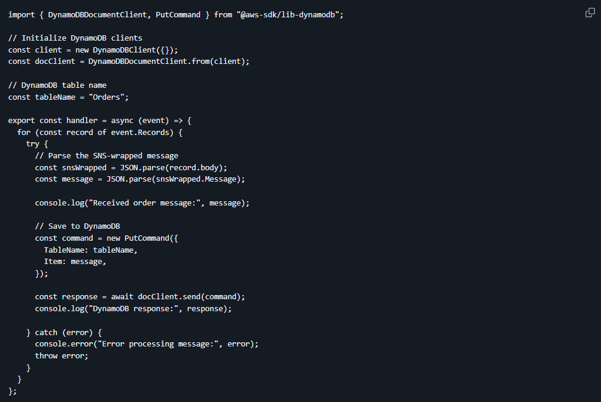
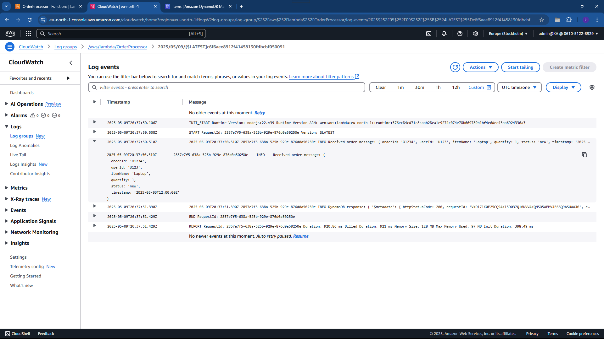
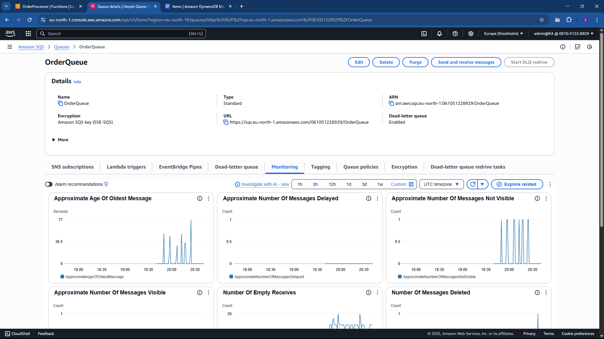
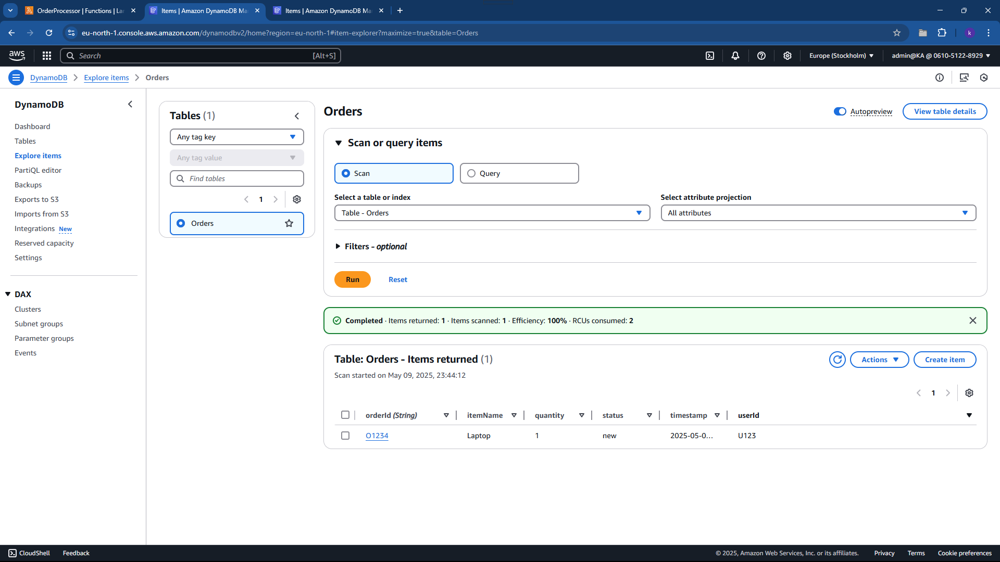

# AWS Event-Driven Order Notification System

## Overview

This project implements a simplified event-driven backend for an e-commerce platform using AWS services. The system accepts orders via SNS, queues them in SQS, processes them with Lambda, stores them in DynamoDB, and ensures reliability with a Dead-Letter Queue (DLQ).

---

## ✅ Architecture Diagram

---

## 📦 AWS Services Used

- **Amazon SNS** – to broadcast new order notifications.
- **Amazon SQS** – to queue messages for Lambda.
- **AWS Lambda** – to process messages and insert orders into DynamoDB.
- **Amazon DynamoDB** – to persist order data.
- **CloudWatch** – to log and monitor Lambda executions.

---

## ⚙️ Setup Instructions

### 1. DynamoDB Table – `Orders`

- Go to **DynamoDB > Create table**
- Table Name: `Orders`
- Partition Key: `orderId` (String)  

---

### 2. SNS Topic – `OrderTopic`

- Go to **SNS > Topics > Create topic**
- Name: `OrderTopic`
- Type: Standard
- After creation, note the ARN for use in SQS subscription.

---

### 3. SQS Queues

#### A. Create Main Queue – `OrderQueue`

- Go to **SQS > Create queue**
- Name: `OrderQueue`
- Type: Standard
- Under **Dead-letter queue**:
  - Enable DLQ
  - Choose: `OrderDLQ` (create first if needed)
  - Set **MaxReceiveCount**: `3`

#### B. Create Dead-Letter Queue – `OrderDLQ`

- Name: `OrderDLQ`
- Type: Standard
- Leave DLQ and redrive policies disabled (this is already a DLQ).

---

### 4. SNS → SQS Subscription

- Go to **SNS > OrderTopic > Create subscription**
- Protocol: **Amazon SQS**
- Endpoint: Select `OrderQueue`

---

### 5. Lambda Function – `OrderProcessor`

#### A. Create the IAM Role

- Go to **IAM > Roles > Create role**
- Use case: **Lambda**
- Attach these policies:
  - `AmazonDynamoDBFullAccess`
  - `AmazonSQSFullAccess`
  - `AWSLambdaBasicExecutionRole`
- Name: `LambdaOrderProcessorRole`

#### B. Create the Lambda Function

- Go to **Lambda > Create Function**
- Runtime: **Node js**
- Function name: `OrderProcessor`
- Use the IAM role above

#### C. Add SQS Trigger

- Go to **Configuration > Triggers > Add trigger**
- Choose SQS
- Select `OrderQueue`

#### D. Lambda Code

### 6. Test case

Published a test message to the SNS Topic:

{
"orderId": "O1234",
"userId": "U123",
"itemName": "Laptop",
"quantity": 1,
"status": "new",
"timestamp": "2025-05-03T12:00:00Z"}

